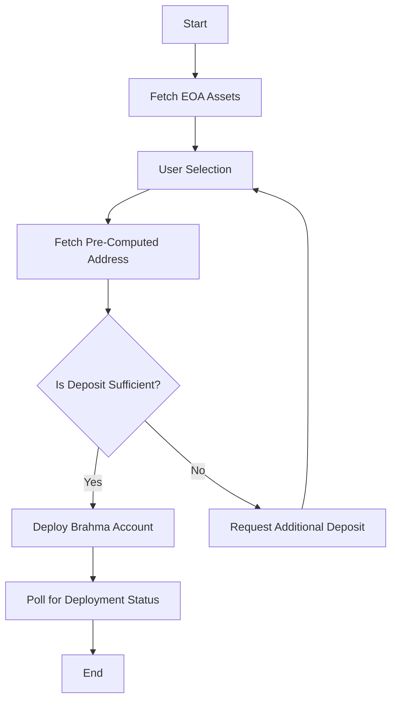

# Brahma Account Deployment Flow

This document outlines the process for managing assets and deploying a Brahma Account using a pre-computed address. The flow involves several steps, from fetching assets to deploying the account and checking the deployment status.



## Flow Overview

1. **Fetch EOA Assets**: Retrieve the balances of assets for a given Externally Owned Account (EOA). See the implementation in [`fetchEoaAssets`](./src/components/strategy/store.ts#L397).
2. **User Selection**: Users select the amount they want to transfer to the pre-computed address.
3. **Fetch Pre-Computed Address**: Obtain the pre-computed address and related data such as fee estimates. See the implementation in [`fetchPreComputedConsoleAddress`](./src/components/strategy/store.ts#L70).
4. **Check Deposit Against Gas Cost**: Ensure the deposited amount covers the gas cost for deploying the Brahma Account.
5. **Request Additional Deposit**: If necessary, prompt the user to deposit more funds.
6. **Deploy Brahma Account**: Generate and deploy the Brahma Account once the deposit is sufficient. See the implementation in [`generateAndDeploySubAccount`](./src/components/strategy/store.ts#L106).
7. **Poll for Deployment Status**: Continuously check the deployment status until completion. See the implementation in [`fetchDeploymentStatus`](./src/components/strategy/store.ts#L248).

## Detailed Steps

### 1. Fetch EOA Assets

- Use the `fetchEoaAssets` function to call `fetchAssetsBalanceMultiCall` and retrieve asset balances. See the API call in [`fetchAssetsBalanceMultiCall`](./src/utils/balances.ts#L30).

### 2. User Selection

- Users interact with the UI to select the amount to transfer.

### 3. Fetch Pre-Computed Address

- Call `fetchPreComputedConsoleAddress` to get the pre-computed address, fee estimate, and signature.

### 4. Check Deposit Against Gas Cost

- Compare the deposited amount with the `feeEstimate` to ensure sufficient funds.

### 5. Request Additional Deposit

- If the deposit is insufficient, prompt the user to add more funds.

### 6. Deploy Brahma Account

- Use `generateAndDeploySubAccount` to generate and deploy the account using the public deployer from `brahma-templates-sdk` calling the functions `generateAutomationSubAccount` and `deployConsoleAndSubAccount`.

### 7. Poll for Deployment Status

- Use `fetchDeploymentStatus` to poll the deployment status using the `fetchTaskStatus` from the `brahma-templates-sdk`'s public deployer.

## Error Handling

- Ensure proper error handling at each step, especially when interacting with APIs.
- Use `dispatchToast` to notify users of errors or status updates. See the implementation in [`dispatchToast`](./src/components/shared/components.ts).

## Conclusion

This flow ensures a seamless process for deploying Brahma Accounts, leveraging pre-computed addresses and efficient asset management.

## Running the app

This is a [RainbowKit](https://rainbowkit.com) + [wagmi](https://wagmi.sh) + [Next.js](https://nextjs.org/) project bootstrapped with [`create-rainbowkit`](/packages/create-rainbowkit).

## Getting Started

First, run the development server:

```bash
npm run dev
```

Open [http://localhost:3000](http://localhost:3000) with your browser to see the result.

You can start editing the page by modifying `pages/index.tsx`. The page auto-updates as you edit the file.

## Learn More

To learn more about this stack, take a look at the following resources:

- [RainbowKit Documentation](https://rainbowkit.com) - Learn how to customize your wallet connection flow.
- [wagmi Documentation](https://wagmi.sh) - Learn how to interact with Ethereum.
- [Next.js Documentation](https://nextjs.org/docs) - Learn how to build a Next.js application.

You can check out [the RainbowKit GitHub repository](https://github.com/rainbow-me/rainbowkit) - your feedback and contributions are welcome!

## Deploy on Vercel

The easiest way to deploy your Next.js app is to use the [Vercel Platform](https://vercel.com/new?utm_medium=default-template&filter=next.js&utm_source=create-next-app&utm_campaign=create-next-app-readme) from the creators of Next.js.

Check out the [Next.js deployment documentation](https://nextjs.org/docs/deployment) for more details
